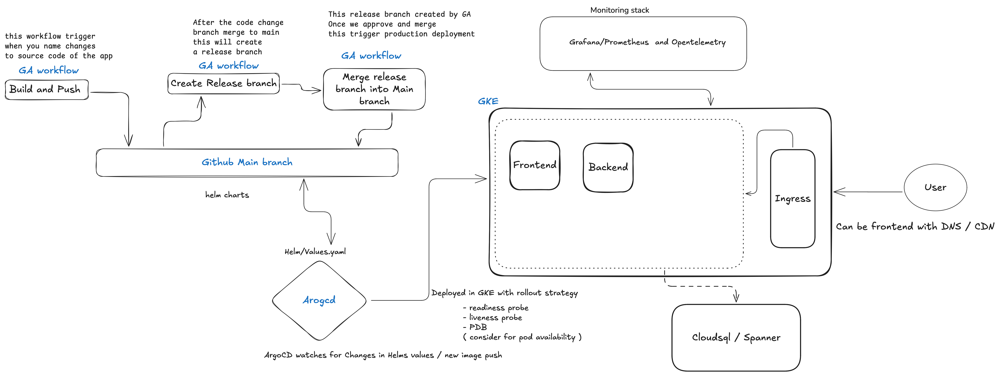

# To-Do App CI/CD Pipeline

This repository contains the implementation of a CI/CD pipeline for a microservices-based To-Do web application hosted on **Google Cloud Platform (GCP)**. It highlights expertise in scalability, monitoring, logging, automation, service discovery, and security, ensuring high availability and resilience. This project is built with **Kubernetes**, **Terraform**, **GitHub Actions**, **Helm**, and **ArgoCD**.

---

## **Architecture**

### High-Level Architecture:



- **Frontend**: React.js-based application served via Kubernetes LoadBalancer.
- **Backend**: Flask-based REST API deployed as a microservice.
- **Database**: Cloud SQL (MySQL) provisioned via Terraform.
- **CI/CD**:
  - **GitHub Actions** for building and pushing Docker images.
  - **Helm** for deployment configuration.
  - **ArgoCD** for automated deployment and sync.
- **Monitoring**: Grafana and Prometheus provide metrics and logs for troubleshooting and analytics.
- **Ingress**: Handles external traffic, with DNS/CDN ready configurations.

---

## **Features of the Solution**

### 1. **Scalability**
- Kubernetes-based architecture for auto-scaling application components.
- Load Balancer for high availability and horizontal scaling.

### 2. **Monitoring and Logging**
- **Prometheus**: Collects infrastructure and application metrics.
- **Grafana**: Provides dashboards for real-time metrics visualization.
- **OpenTelemetry**: Offers enhanced logging and traceability. ( Not in implimented in current deployment )

### 3. **Service Discovery**
- All microservices communicate using Kubernetes service discovery.
- Backend and database communicate internally, ensuring a private network.

### 4. **Security**
- Secrets managed via Kubernetes secrets or external secrets manager. ( GCP secret manager used)
- Least-privilege access policies with RBAC for Kubernetes and GCP.
- Enforced HTTPS communication via Ingress.

### 5. **High Availability**
- Multi-replica deployments ensure zero downtime.
- Deployment strategies (e.g., rolling updates) minimize risk during updates.

---

## **CI/CD Workflow**

### **Build and Push Workflow**
- **Trigger**: On feature branch updates.
- **Actions**:
  1. Builds Docker images for frontend and backend.
  2. Tags images with commit SHA and pushes them to **Google Artifact Registry**.
- Workflow File: [docker-build-push.yml](./.github/workflows/docker-build-push.yml)

### **Release Workflow**
- **Trigger**: Merge of feature branch into the main branch.
- **Actions**:
  1. Creates a release branch.
  2. Updates Helm `values.yaml` with new Docker image tags.
  3. Pushes the release branch for approval.
- Workflow File: [release.yml](./.github/workflows/release.yml)

### **Production Deployment**
- **Trigger**: Merge of release branch into the main branch.
- **Actions**:
  1. ArgoCD syncs Helm chart changes.
  2. GKE applies the updated configuration, ensuring a smooth rollout.

---

## **Developer Workflow**

### **Step 1: Feature Development**
1. Clone the repository:
   ```bash
   git clone https://github.com/<your-org>/todo-cicd.git
   cd todo-cicd

2. Create a new branch for your feature:
    ```bash
    git checkout -b feature/your-feature

3. Push your changes:
   ```bash
   git add .
   git commit -m "Add feature description"
   git push origin feature/your-feature

Step 2: CI/CD Process

    Open a pull request (PR) to the main branch.
    Once the PR is approved, merge it into main.

Step 3: Release Creation

    The release workflow creates a release branch and updates the Helm chart with new image tags.

Step 4: Production Deployment

    After release branch approval, merge it into the main branch.
    ArgoCD deploys the changes to production.

### Helm Configuration
Backend Configuration:

```yaml
backend:
  image:
    repository: asia-northeast1-docker.pkg.dev/stone-botany-440911-u3/devops-webapp/backend
    tag: "<commit-sha>"
  replicas: 3

Frontend Configuration:

```yaml
frontend:
  image:
    repository: asia-northeast1-docker.pkg.dev/stone-botany-440911-u3/devops-webapp/frontend
    tag: "<commit-sha>"
  replicas: 3

Monitoring Setup
Tools:

    Prometheus: Scrapes and stores metrics.
    Grafana: Dashboards for performance analysis.
    OpenTelemetry: Provides tracing and enhanced logs.

Access:

    Grafana Dashboard: http://34.146.102.4:3000
    ArgoCD: https://34.146.203.80/applications

Infrastructure Setup
Tools:

    Terraform: Automates infrastructure provisioning.
    Google Cloud: Used for hosting the application.
    Kubernetes: Orchestrates the deployment.

Terraform Commands:

    Initialize Terraform:

terraform init

Apply the infrastructure:

    terraform apply -var-file=vars.tfvars

Security Considerations

    Secrets Management:
        Use Kubernetes secrets or an external secrets manager.
    Network Policies:
        Restrict access to backend and database to internal Kubernetes pods.
    RBAC:
        Restrict permissions for Kubernetes resources.
    Artifact Registry:
        Secure image access using GCP service accounts.

Key URLs

    Production App: http://35.201.87.24/
    Grafana Dashboard: http://34.146.102.4:3000
    ArgoCD Dashboard: https://34.146.203.80/applications